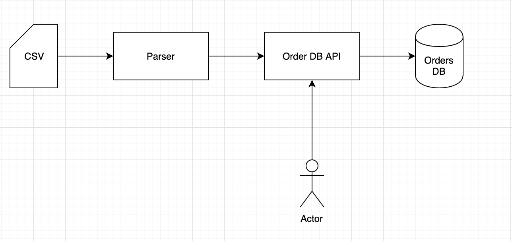

# Order DB API

### Diagram:


### GET Routes:

#### /orderInfo 
* Required query params: objectId
* Optional query params: timestamp (if not provided, will fetch most recent order if available)
###### Request examples: 
* /order?objectId=1 
* /order?objectId=2&timestamp=1484731400

###### Response examples: (format: json)
* {"customerName":"Jack","customerAddress":"Trade St.","status":"UNPAID","timestamp":1484730554}

#### /health
* Required query params: none
* Optional query params: none

###### Request examples: 
* /health

###### Response examples:
(Response code: 200)

### POST Routes:

#### /orderInfo
* Required request body params: none
* Optional request body params: objectId, timestamp, customerName, customerAddress, shipDate, shippingProvider, status in (UNPAID, PAID, SHIPPED)  

###### Response examples:
(Response code: 201, 400, or 409 if duplicate)

##### Response codes:
| Response Code | Response Status |
|---------------|-----------------|
| 200           | Success         |
| 201           | Created         |
| 404           | Not Found       |
| 400           | Bad Request     |
| 409           | Conflict        |


### Developer's Corner:
```bash
git clone https://github.com/tk3413/tg-orders-api.git
cd tradegecko
Use your favorite editor to update DB password in: src/main/resources/application.properties
mvn clean install
mvn spring-boot:run
```